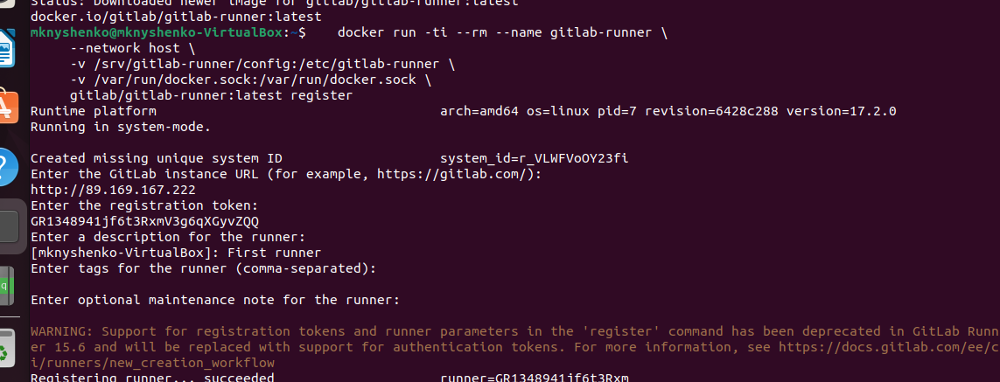
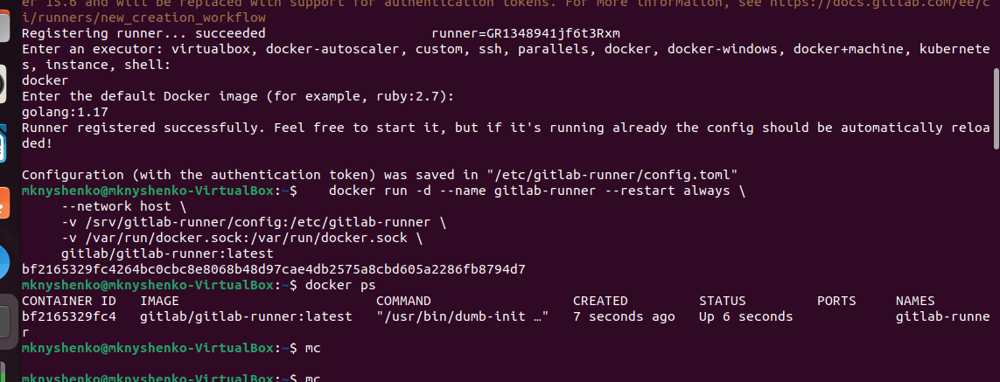

# Домашнее задание к занятию «GitLab»
## Задание 1

[Поднятый Gitlab](http://89.169.167.222/netology/netology-8-03)

Создаем и регистрируем runner





## Задание 2

Файл .gitlab-ci.yml

```
stages:
  - test
  - build

test:
  stage: test
  image: golang:1.17
  script: 
   - go test .

build:
  stage: build
  image: docker:latest
  script:
   - docker build .

```


