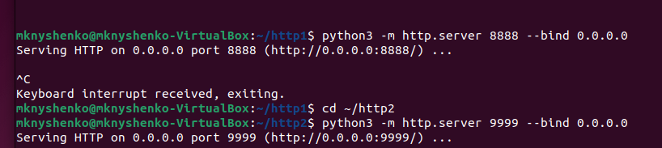
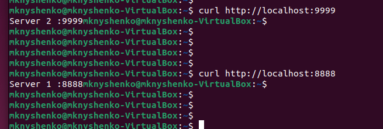
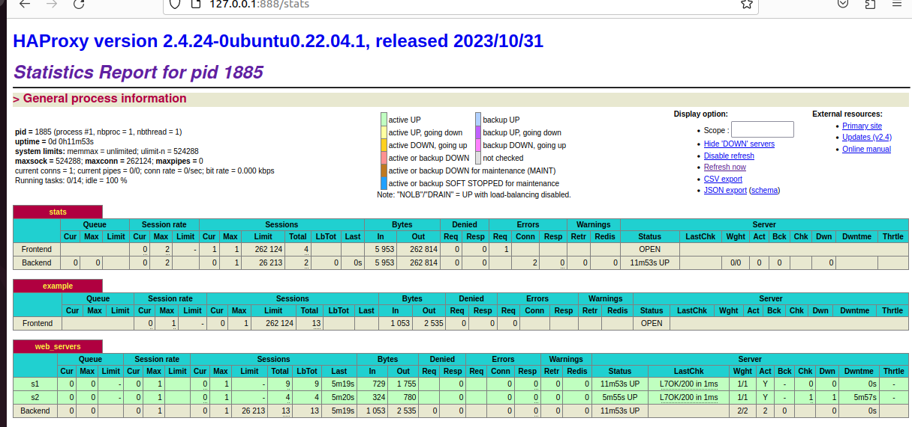
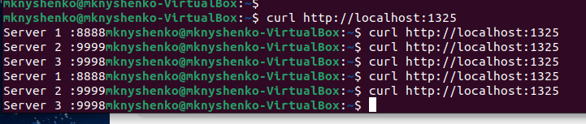
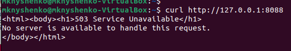
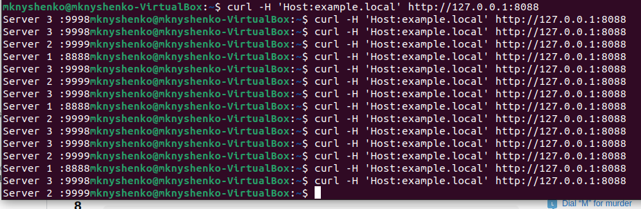

# Домашнее задание к занятию 2 «Кластеризация и балансировка нагрузки»
## Конфигурационный файл HAProxy
[haproxy.cfg](haproxy.cfg)
## Задание 1
* Запустите два simple python сервера на своей виртуальной машине на разных портах
* Установите и настройте HAProxy, воспользуйтесь материалами к лекции по ссылке
* Настройте балансировку Round-robin на 4 уровне.
* На проверку направьте конфигурационный файл haproxy, скриншоты, где видно перенаправление запросов на разные серверы при обращении к HAProxy.
### Решение
Запускаем два simple python сервера



Проверим, что серверы работают



Установим HAProxy и внесем в конфигурационный файл наши серверы.

Секции global и defaults оставим без изменений.

Добавим блок для отображжения статистики

```
listen stats  # веб-страница со статистикой
        bind                    :888
        mode                    http
        stats                   enable
        stats uri               /stats
        stats refresh           5s
        stats realm             Haproxy\ Statistics
```

Проверим, что HAProxy работает



Настроим балансировку на 4-ом, то есть транспортном уровне

```
listen web_tcp

	bind :1325
	
	server s1 127.0.0.1:8888 check inter 3s
	server s2 127.0.0.1:9999 check inter 3s
	server s3 127.0.0.1:9998 check inter 3s
```

Проверим, что запросы перенаправляются на разные серверы. Вес каждого сервера не указан, поэтому они отвечают по очереди.



## Задание 2
* Запустите три simple python сервера на своей виртуальной машине на разных портах
* Настройте балансировку Weighted Round Robin на 7 уровне, чтобы первый сервер имел вес 2, второй - 3, а третий - 4
* HAproxy должен балансировать только тот http-трафик, который адресован домену example.local
* На проверку направьте конфигурационный файл haproxy, скриншоты, где видно перенаправление запросов на разные серверы при обращении к HAProxy c использованием домена example.local и без него.
### Решение

Отметим в конфигурационном файле, что нужно балансировать только тот http-трафик, который адресован домену example.local

```
frontend example  # секция фронтенд
        mode http
        bind :8088
        #default_backend web_servers
	acl ACL_example.local hdr(host) -i example.local
	use_backend web_servers if ACL_example.local
```

Проверяем



Укажем каждому серверу свой вес

```
backend web_servers    # секция бэкенд
        mode http
        balance roundrobin
        option httpchk
        http-check send meth GET uri /index.html
        server s1 127.0.0.1:8888 check weight 2
        server s2 127.0.0.1:9999 check weight 3
        server s3 127.0.0.1:9998 check weight 4
```

Проверяем



Серверы отвечают не по очереди, а согласно своим весам.
