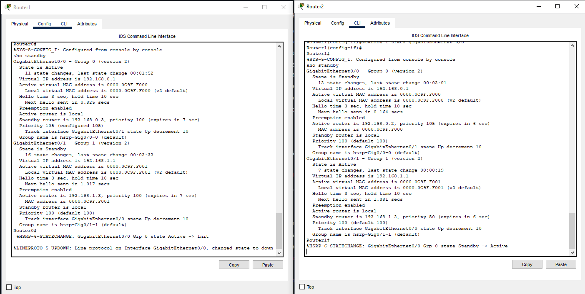
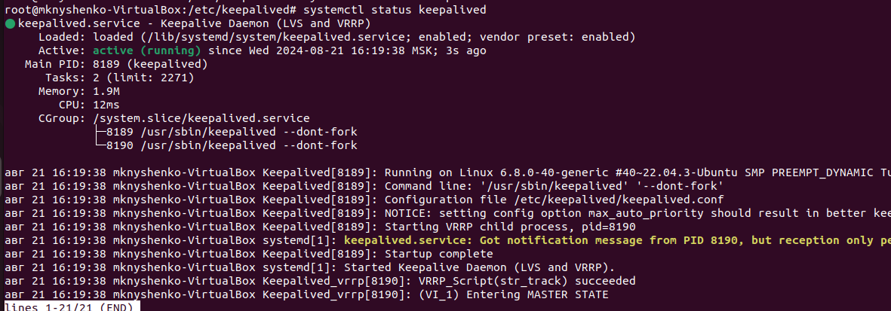
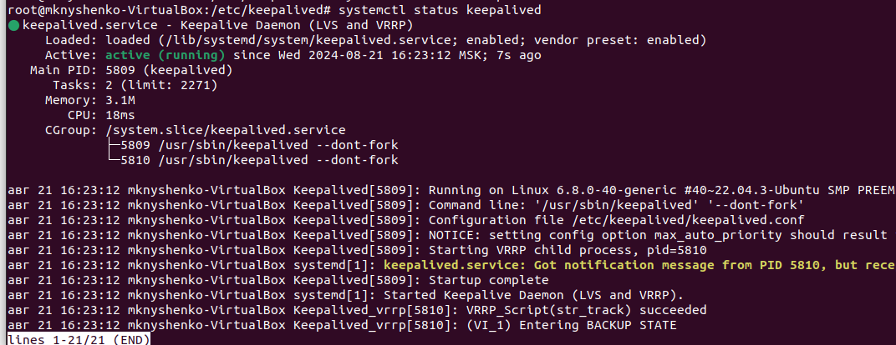
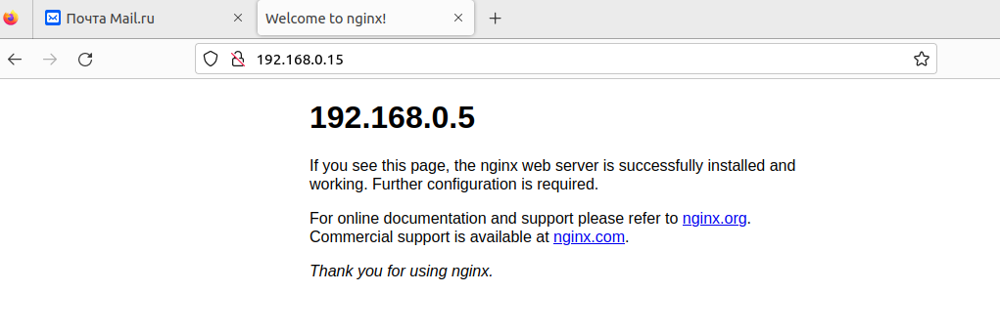
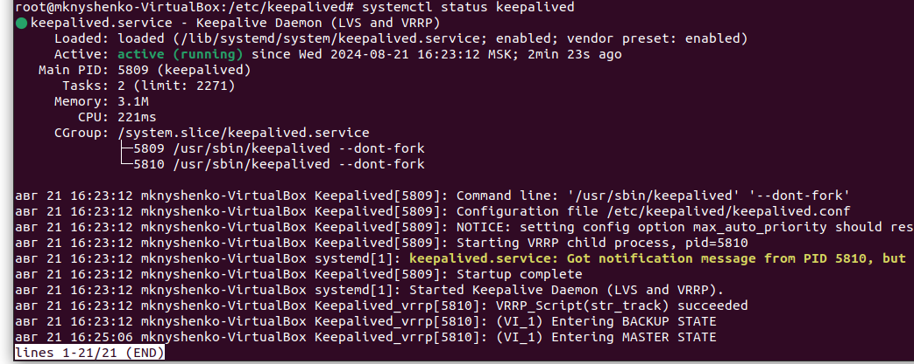
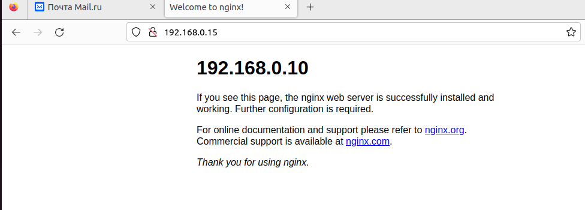

# Домашнее задание к занятию 1 «Disaster recovery и Keepalived»
## Задание 1
* Дана схема для Cisco Packet Tracer, рассматриваемая в лекции.
* На данной схеме уже настроено отслеживание интерфейсов маршрутизаторов Gi0/1 (для нулевой группы)
* Необходимо аналогично настроить отслеживание состояния интерфейсов Gi0/0 (для первой группы).
* Для проверки корректности настройки, разорвите один из кабелей между одним из маршрутизаторов и Switch0 и запустите ping между PC0 и Server0.
* На проверку отправьте получившуюся схему в формате pkt и скриншот, где виден процесс настройки маршрутизатора.
### Решение
На снимке экрана команд sho standby отражено что для интерфейсов g0/0 g0/1 настроен hsrp preempt. Позволяет сделать роутер активным сразу как приоритет увеличивается.
Настроен standby track, позволяющий отслеживать состояние интерфейсов и изменять приоритет.


[Схема](task_1_cisco.pkt)

## Задание 2
* Запустите две виртуальные машины Linux, установите и настройте сервис Keepalived как в лекции, используя пример конфигурационного файла.
* Настройте любой веб-сервер (например, nginx или simple python server) на двух виртуальных машинах
* Напишите Bash-скрипт, который будет проверять доступность порта данного веб-сервера и существование файла index.html в root-директории данного веб-сервера.
* Настройте Keepalived так, чтобы он запускал данный скрипт каждые 3 секунды и переносил виртуальный IP на другой сервер, если bash-скрипт завершался с кодом, отличным от нуля (то есть порт веб-сервера был недоступен или отсутствовал index.html). Используйте для этого секцию vrrp_script
* На проверку отправьте получившейся bash-скрипт и конфигурационный файл keepalived, а также скриншот с демонстрацией переезда плавающего ip на другой сервер в случае недоступности порта или файла index.html
### Решение
Запустим nginx на двух вртуальных машинах.

Первый адрес 192.168.0.5 (это будет нащ MASTER)
Второй адрес 192.168.0.10 (это будет BACKUP)

Адрес 192.168.0.15 будет "плавать".

Подготовим скрипт.
```
#!bin/bash
PORT=$(bash -c 'exec 3<> /dev/tcp/127.0.0.1/80;echo $?' 2>/dev/null)
echo "$PORT"
echo "$FILE"
if [[ $PORT -eq 0 && $FILE -eq 0 ]]; then
  echo "0" > /tmp/track_file
  exit 0
else
  echo "1" > /tmp/track_file
  exit 1
fi
```
Подготовим файл конфигурации для MASTER
```
global_defs {
  script_user root
  enable_script_security
}

vrrp_script str_track {
script "/etc/keepalived/nginx_recovery.sh"
interval 3
}
vrrp_instance VI_1 {
        state MASTER
        interface enp0s8
        virtual_router_id 15
        priority 255
        advert_int 1

        virtual_ipaddress {
              192.168.0.15/24
        }
track_script {
str_track
}
}
```
Подготовим файл конфигурации BACKUP

```
global_defs {
  script_user root
  enable_script_security
}

vrrp_script str_track {
script "/etc/keepalived/nginx_recovery.sh"
interval 3
}
vrrp_instance VI_1 {
        state BACKUP
        interface enp0s8
        virtual_router_id 15
        priority 200
        advert_int 1

        virtual_ipaddress {
              192.168.0.15/24
        }
track_script {
str_track
}
}
```
Проверим MASTER



Проверим BACKUP



Зайдем на адрес 192.168.0.15 и убедимся, что ответ мы получаем с мастера



Теперь остановим nginx на мастере

Зайдем в BACKUP и посмотрим, что произошло переключение



Зайдем на адрес 192.168.0.15 и убедимся, что он "уплыл" к BACKEND


