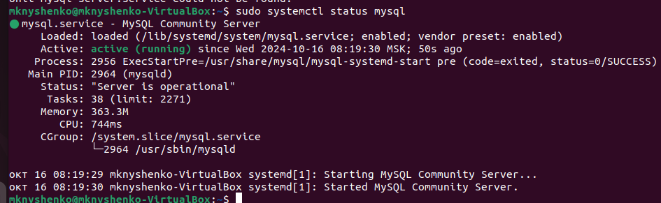
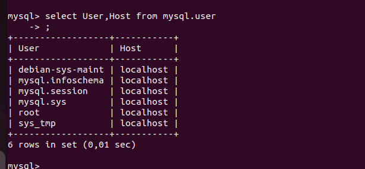
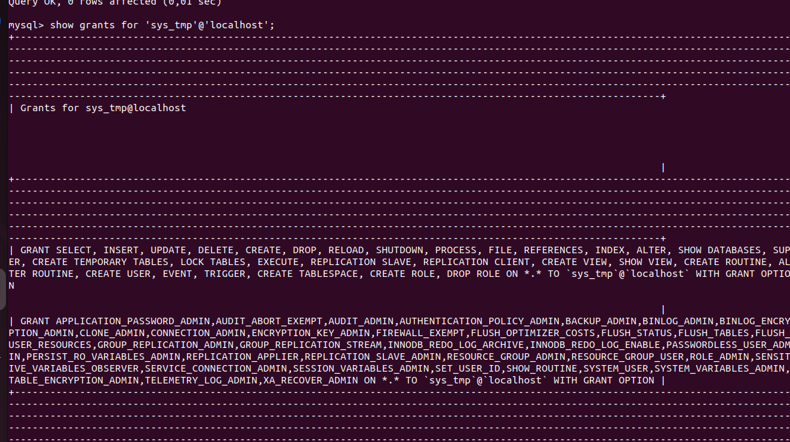

# Домашнее задание к занятию «Работа с данными (DDL/DML)»
## Задание 1

1.1. Поднимите чистый инстанс MySQL версии 8.0+. Можно использовать локальный сервер или контейнер Docker.



1.2. Создайте учётную запись sys_temp.

```
mysql -u root -p 
create user 'sys_tmp'@'localhost' identified by 'очень сложный пароль';
exit

```

1.3. Выполните запрос на получение списка пользователей в базе данных. (скриншот)

```
mysql -u root -p 
select User,Host from mysql.user;
exit

```


1.4. Дайте все права для пользователя sys_tmp.

```
mysql -u root -p 
grant ALL PRIVILEGES on *.* to 'sys_tmp'@'localhost' with GRANT option;
flush privileges;
exit

```

1.5. Выполните запрос на получение списка прав для пользователя sys_tmp. (скриншот)

```
mysql -u root -p 
show grants for 'sys_tmp'@'localhost';
exit

```



1.6. Переподключитесь к базе данных от имени sys_temp.

Для смены типа аутентификации с sha2 используйте запрос:

```
ALTER USER 'sys_test'@'localhost' IDENTIFIED WITH mysql_native_password BY 'password';
```

```
mysql -u sys_tmp -p 
alter user 'sys_tmp'@'localhost' IDENTIFIED with mysql_native_password by 'очень сложный пароль';
exit

```

1.6. По ссылке https://downloads.mysql.com/docs/sakila-db.zip скачайте дамп базы данных.

```
wget -c https://downloads.mysql.com/docs/sakila-db.zip
unzip sakila-db.zip
cd sakila-db

```

1.7. Восстановите дамп в базу данных.

```
mysql -u sys_tmp -p
show databases;
create database SakilaDB;
show databases;
use SakilaDB;
show tables;
source sakila-schema.sql;
source sakila-data.sql;
show tables;
exit

```

1.8. При работе в IDE сформируйте ER-диаграмму получившейся базы данных. При работе в командной строке используйте команду для получения всех таблиц базы данных. (скриншот)

```
mysql -u sys_tmp -p
show databases;
use SakilaDB;
show tables;
exit

```

![Получить таблицы(show_tables.png)
