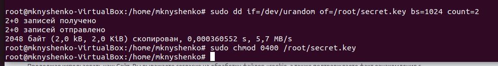

# Домашнее задание к занятию «Защита хоста»

## Задание 1

 1. Установите eCryptfs.
 2. Добавьте пользователя cryptouser.
 3. Зашифруйте домашний каталог пользователя с помощью eCryptfs.

*В качестве ответа пришлите снимки экрана домашнего каталога пользователя с исходными и зашифрованными данными.*

### Решение

Сначала создадим пользователя.

Посмотрим домашний каталог пользователя "ДО".

Шифруем

Посмотрим домашний каталог пользвателя "ПОСЛЕ".

## Задание 2

1. Установите поддержку LUKS.
2. Создайте небольшой раздел, например, 100 Мб.
3. Зашифруйте созданный раздел с помощью LUKS.

*В качестве ответа пришлите снимки экрана с поэтапным выполнением задания.*

### Решение

Сначала найдем подходящий диск.

Создадим ключ.

Шифруем

Проверим, что устройство ввода-вывода LUKS теперь доступно в /dev/mapper/secret.

Создаем файловую систему, например ext4

Проверим состояние устройства

Монтируем

