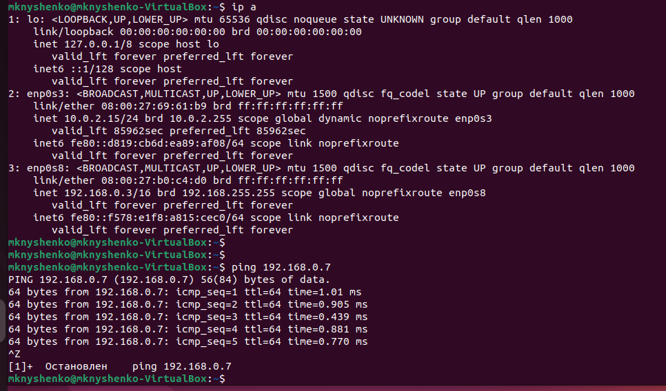
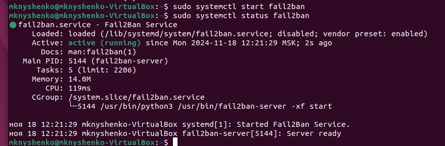
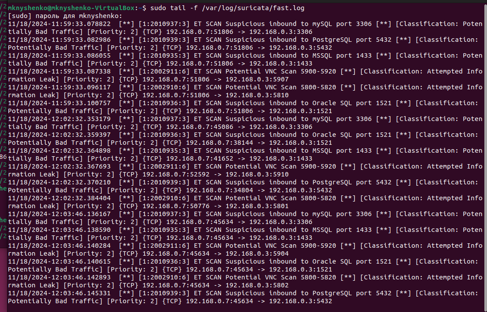
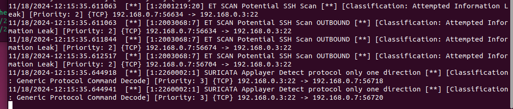
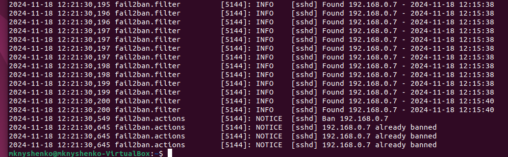

# Домашнее задание к занятию «Защита сети»

## Подготовка к выполнению заданий

1. Подготовка защищаемой системы:
* установите Suricata,
* установите Fail2Ban.
2. Подготовка системы злоумышленника: установите nmap и thc-hydra либо скачайте и установите Kali linux.

Обе системы должны находится в одной подсети.

### Решение

Сделаем два виртуальные машины

* 192.168.0.3 - Защищаемая машина с Ubuntu
* 192.168.0.7 - Машина злоумышленника с Kali Linux



На защищаемой машине:

1. Установим Suricata


   
2. Установим Fail2Ban



## Задание 1

Проведите разведку системы и определите, какие сетевые службы запущены на защищаемой системе:

**sudo nmap -sA < ip-адрес >**

**sudo nmap -sT < ip-адрес >**

**sudo nmap -sS < ip-адрес >**

**sudo nmap -sV < ip-адрес >**

По желанию можете поэкспериментировать с опциями: https://nmap.org/man/ru/man-briefoptions.html.

*В качестве ответа пришлите события, которые попали в логи Suricata и Fail2Ban, прокомментируйте результат.*

### Решение

На машине злоумышленника выполним команды:

```
sudo nmap -sS 192.168.0.3

sudo nmap -sA 192.168.0.3

sudo nmap -sT 192.168.0.3

sudo nmap -sV 192.168.0.3
```

Посмотрим лог suricata



В логе согласно правилам отразилось сканирование портов 3306, 5432, 5900-5920, 5800-5820, 1521 c машины с ip 192.168.0.7.

# Задание 2

Проведите атаку на подбор пароля для службы SSH:

**hydra -L users.txt -P pass.txt < ip-адрес > ssh**

1. Настройка hydra:

* создайте два файла: users.txt и pass.txt;
* в каждой строчке первого файла должны быть имена пользователей, второго — пароли. В нашем случае это могут быть случайные строки, но ради эксперимента можете добавить имя и пароль существующего пользователя.

Дополнительная информация по hydra: https://kali.tools/?p=1847.

2. Включение защиты SSH для Fail2Ban:

* открыть файл /etc/fail2ban/jail.conf,
* найти секцию ssh,
* установить enabled в true.

Дополнительная информация по Fail2Ban:https://putty.org.ru/articles/fail2ban-ssh.html.

*В качестве ответа пришлите события, которые попали в логи Suricata и Fail2Ban, прокомментируйте результат.*

### Решение

Выполним на машина с Kali команду для подбора паролей:

```
hydra -L users.txt -P pass.txt 192.168.0.3 ssh
```

Посмотрим лог suricata



Посмотрим лог fail2ban



После нескольких попыток подобрать пароль ip 192.168.0.7 был забанен.
