# Домашнее задание к занятию «Очереди RabbitMQ»

## Задание 1. Установка RabbitMQ

Используя Vagrant или VirtualBox, создайте виртуальную машину и установите RabbitMQ. Добавьте management plug-in и зайдите в веб-интерфейс.

### Решение

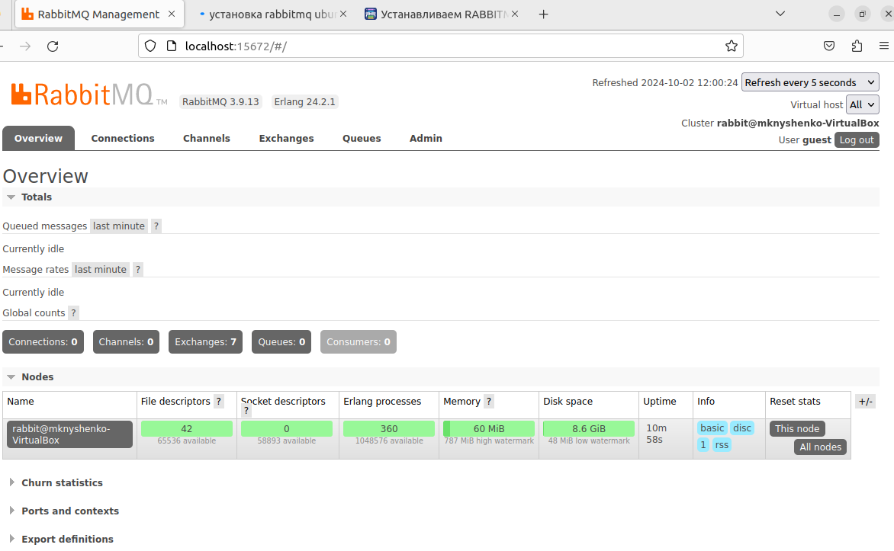

## Задание 2. Отправка и получение сообщений

Используя приложенные скрипты, проведите тестовую отправку и получение сообщения. Для отправки сообщений необходимо запустить скрипт producer.py.

Для работы скриптов вам необходимо установить Python версии 3 и библиотеку Pika. Также в скриптах нужно указать IP-адрес машины, на которой запущен RabbitMQ, заменив localhost на нужный IP.

```
$ pip install pika
```

Зайдите в веб-интерфейс, найдите очередь под названием hello и сделайте скриншот. После чего запустите второй скрипт consumer.py и сделайте скриншот результата выполнения скрипта

### Решение

Созданная очередь

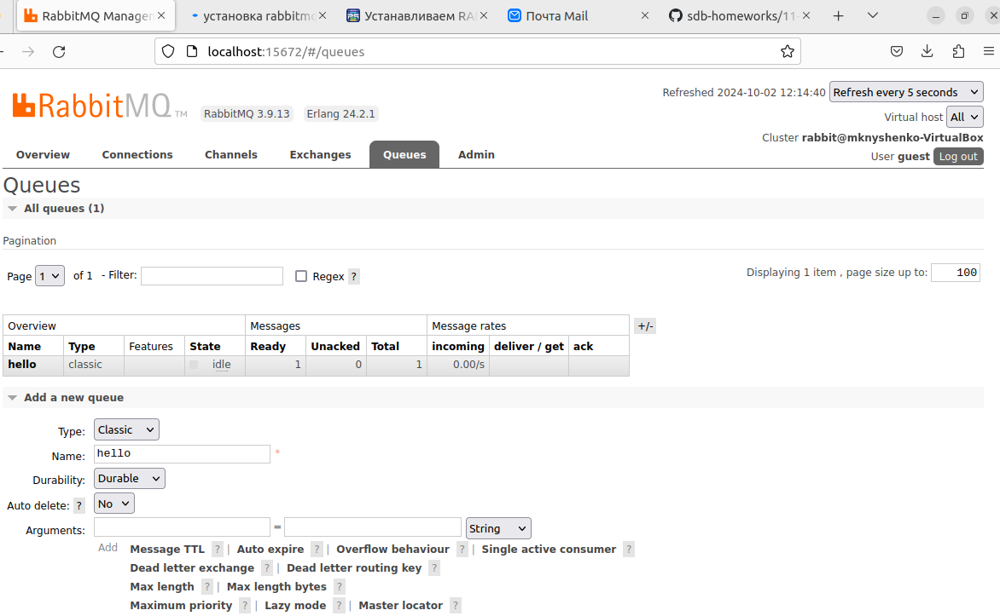

Результат скрипта consumer.py

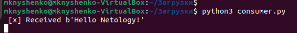

## Задание 3. Подготовка HA кластера

Используя Vagrant или VirtualBox, создайте вторую виртуальную машину и установите RabbitMQ. Добавьте в файл hosts название и IP-адрес каждой машины, чтобы машины могли видеть друг друга по имени.

Пример содержимого hosts файла:

```
$ cat /etc/hosts
192.168.0.10 rmq01
192.168.0.11 rmq02
```

После этого ваши машины могут пинговаться по имени.

Затем объедините две машины в кластер и создайте политику ha-all на все очереди.

В качестве решения домашнего задания приложите скриншоты из веб-интерфейса с информацией о доступных нодах в кластере и включённой политикой.

Также приложите вывод команды с двух нод:

```
$ rabbitmqctl cluster_status
```

Для закрепления материала снова запустите скрипт producer.py и приложите скриншот выполнения команды на каждой из нод:

```
$ rabbitmqadmin get queue='hello'
```

После чего попробуйте отключить одну из нод, желательно ту, к которой подключались из скрипта, затем поправьте параметры подключения в скрипте consumer.py на вторую ноду и запустите его.

### Решение

Сначала на каждой машине в файле hosts пропишем

```
192.168.0.2 rmq01.rabbit
192.168.0.3 rmq02.rabbit
```

На ноде 1 в файле /etc/rabbitmq/rabbitmq-env.conf пропишем

```
RABBITMQ_NODENAME=rabbit@rmq01.rabbit
RABBITMQ_USE_LONGNAME=true
```

На ноде 2 в файле /etc/rabbitmq/rabbitmq-env.conf пропишем

```
RABBITMQ_NODENAME=rabbit@rmq02.rabbit
RABBITMQ_USE_LONGNAME=true
```

Скопируем Cookie /var/lib/rabbitmq/.erlang.cookie с первого узла rmq01.rabbit на rmq02.rabbit.

Перезапустем RabbitMQ на каждой машине.

Остановим RabbitMQ на ноде rmq02.rabbit и добавим вторую ноду в кластер.

Снова запустим RabbitMQ.

Две ноды:

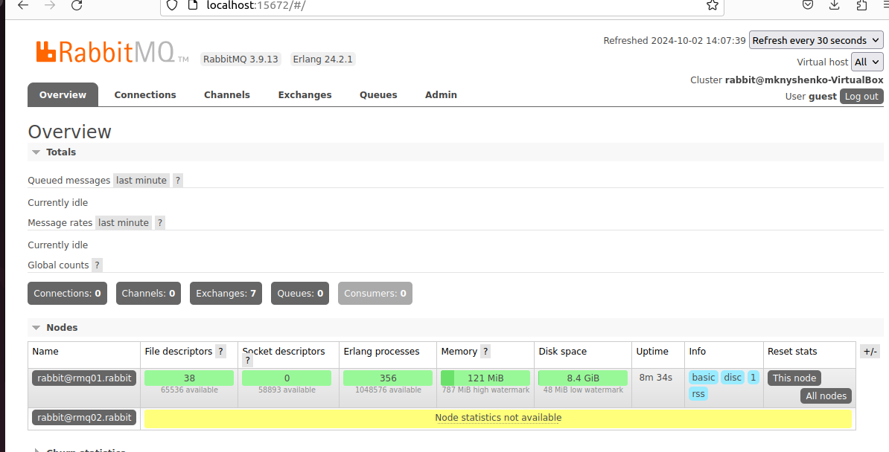

Вывод cluster_status 1-ая нода

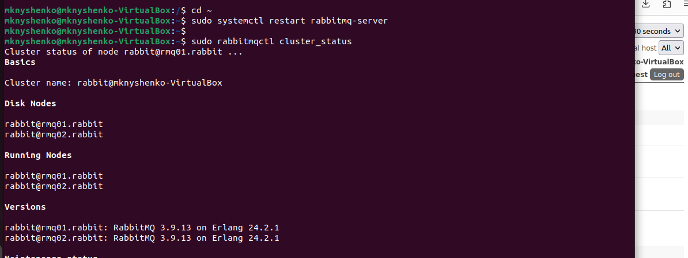

Вывод cluster_status 2-ая нода

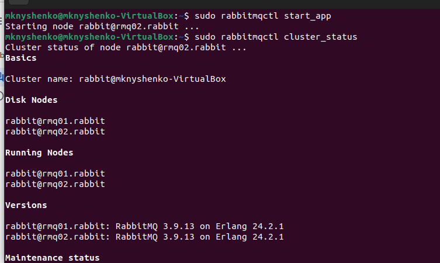

Добавим политику ha-all

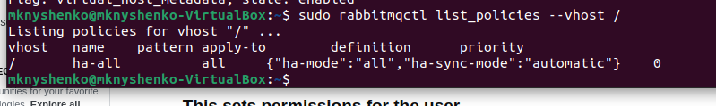

Запустим скрипт producer.py.

Вывод get queue 1-ая нода

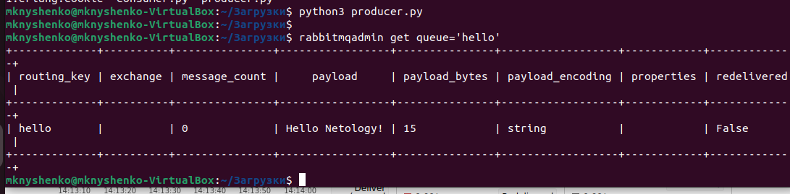

Вывод get queue 2-ая нода

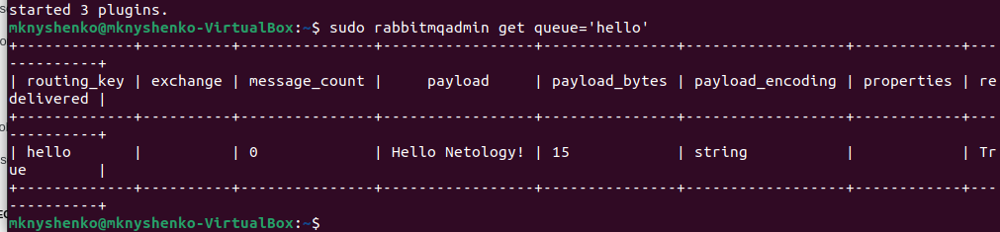

Теперь остановим RabbitMQ на ноде 1. В cluster_status у нас теперь только одна нода.

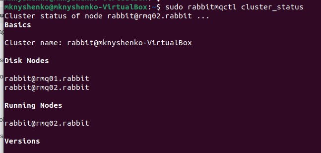

Скрипт consumer.py находится на ноде 1, где мы остановили приложение.
В RabbitMQ создадим нового пользователя marina и дадим ему права на /.
Доработаем скрипт, чтобы он мог подключиться ко второй ноде с помощью данных нового пользователя.

```
#!/usr/bin/env python
# coding=utf-8
import pika


credentials = pika.PlainCredentials('marina', 'здесь очень сложный пароль')
parameters = pika.ConnectionParameters('rmq02.rabbit',
                                   5672,
                                   '/',
                                   credentials)
connection = pika.BlockingConnection(parameters)
channel = connection.channel()
channel.queue_declare(queue='hello')


def callback(ch, method, properties, body):
    print(" [x] Received %r" % body)


channel.basic_consume('hello', callback, auto_ack=True)
channel.start_consuming()
```

Запускаем скрипт

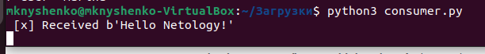
