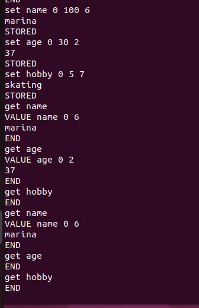

# Домашнее задание к занятию «Кеширование Redis/memcached»

## Задание 1. Кеширование

Приведите примеры проблем, которые может решить кеширование.

### Решение

1. Увеличение скорости ответа. При кешировании медиа-файлов, таких как изображения, видео или аудио, пользователи могут получать быстрый доступ к этим файлам, без необходимости загружать их с сервера каждый раз.
2. Экономия ресурсов базы данных. Кеширование запросов к базе данных может значительно уменьшить нагрузку на сервер и сократить время, необходимое для обработки запросов от пользователей.
3. Кеширование может помочь пережить резкое увеличение трафика, например, во время черной пятницы.
4. Кеширование API запросов может улучшить производительность приложений, позволяя им получать данные из кеша вместо того чтобы делать запросы к удаленному серверу при каждом обновлении.

## Задание 2. Memcached

Установите и запустите memcached.

### Решение

## Задание 3. Удаление по TTL в Memcached

Запишите в memcached несколько ключей с любыми именами и значениями, для которых выставлен TTL 5.

### Решение

## Задание 4. Запись данных в Redis

Запишите в Redis несколько ключей с любыми именами и значениями.

### Решение

С таблицами

## Дополнительные задания (со звёздочкой*)

Эти задания дополнительные, то есть не обязательные к выполнению, и никак не повлияют на получение вами зачёта по этому домашнему заданию. Вы можете их выполнить, если хотите глубже разобраться в материале.

### Задание 5*. Работа с числами

Запишите в Redis ключ key5 со значением типа "int" равным числу 5. Увеличьте его на 5, чтобы в итоге в значении лежало число 10.

### Решение

