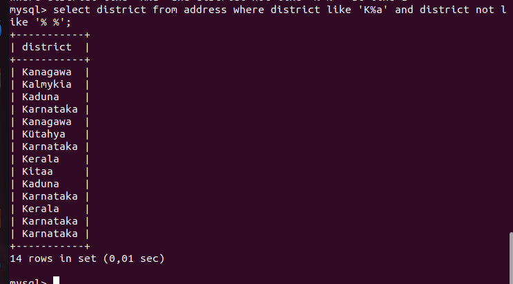
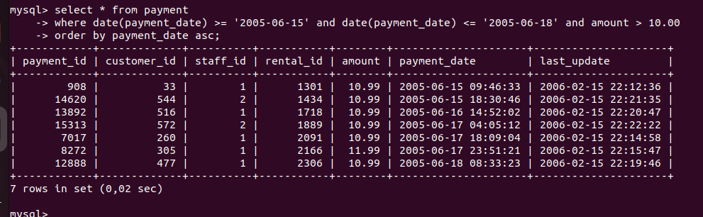
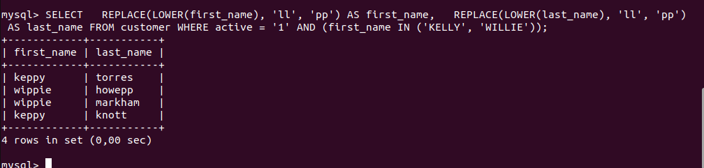

# Домашнее задание к занятию «SQL. Часть 1»
## Задание 1

Получите уникальные названия районов из таблицы с адресами, которые начинаются на “K” и заканчиваются на “a” и не содержат пробелов.

### Решение

```
select district from address where district like 'K%a' and district not like '% %';
```



## Задание 2

Получите из таблицы платежей за прокат фильмов информацию по платежам, которые выполнялись в промежуток с 15 июня 2005 года по 18 июня 2005 года включительно и стоимость которых превышает 10.00.

### Решение

```
select * from payment where date(payment_date) >= '2005-06-15' and date(payment_date) <= '2005-06-18' and amount > 10.00 order by payment_date asc;
```



## Задание 3

Получите последние пять аренд фильмов.

### Решение

```
SELECT * FROM rental ORDER BY rental_date DESC LIMIT 5;
```


## Задание 4

Одним запросом получите активных покупателей, имена которых Kelly или Willie.

Сформируйте вывод в результат таким образом:

* все буквы в фамилии и имени из верхнего регистра переведите в нижний регистр,
* замените буквы 'll' в именах на 'pp'.

### Решение

```
SELECT   REPLACE(LOWER(first_name), 'll', 'pp') AS first_name,   REPLACE(LOWER(last_name), 'll', 'pp')   AS last_name FROM customer WHERE active = '1' AND (first_name IN ('KELLY', 'WILLIE'));
```


