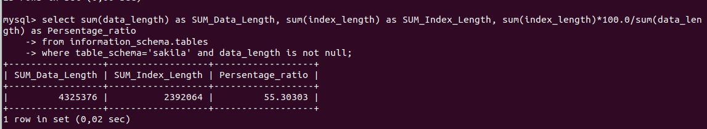
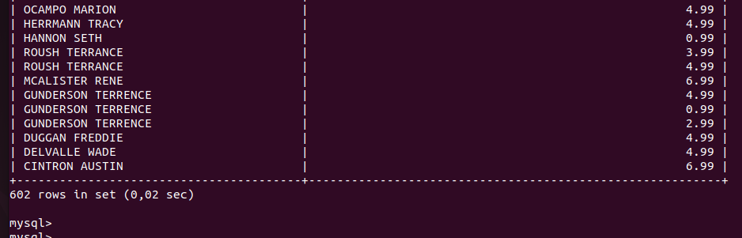

# Домашнее задание к занятию «Индексы»

## Задание 1

Напишите запрос к учебной базе данных, который вернёт процентное отношение общего размера всех индексов к общему размеру всех таблиц.

### Решение

```
select sum(data_length) as SUM_Data_Length, sum(index_length) as SUM_Index_Length, sum(index_length)*100.0/sum(data_length) as Persentage_ratio
from information_schema.tables
where table_schema='sakila' and data_length is not null;
```



## Задание 2

Выполните explain analyze следующего запроса:

```
select distinct concat(c.last_name, ' ', c.first_name), sum(p.amount) over (partition by c.customer_id, f.title)
from payment p, rental r, customer c, inventory i, film f
where date(p.payment_date) = '2005-07-30' and p.payment_date = r.rental_date and r.customer_id = c.customer_id and i.inventory_id = r.inventory_id;
```

*перечислите узкие места;
*оптимизируйте запрос: внесите корректировки по использованию операторов, при необходимости добавьте индексы.

### Решение

Сначала просто выполним запрос


Далее выполним explain analyze.

Узкие места могут включать:
* Использование функции DATE() на p.payment_date, что может препятствовать использованию индексов.
* Возможное отсутствие индексов на ключевых столбцах для соединений и фильтрации.
* Вместо использования разделенного запятыми списка таблиц и условий в WHERE попробуем использовать JOIN'ы.

Оптимизируем запрос следующим образом:

* убедимся, что на следующих столбцах есть индексы:
  * payment.payment_date
  * rental.rental_date
  * customer.customer_id
  * inventory.inventory_id
  * film.film_id
* поправим условие where
* добавим join.

Вот что получилось:

```
SELECT DISTINCT CONCAT(c.last_name, ' ', c.first_name),
       SUM(p.amount) OVER (PARTITION BY c.customer_id, f.title)
FROM payment p
JOIN rental r ON p.payment_date = r.rental_date
JOIN customer c ON r.customer_id = c.customer_id
JOIN inventory i ON i.inventory_id = r.inventory_id
JOIN film f ON f.film_id = i.film_id
WHERE p.payment_date >= '2005-07-30 00:00:00' AND p.payment_date < '2005-07-31 00:00:00';
```



Запрос стал выполняться быстрее.
