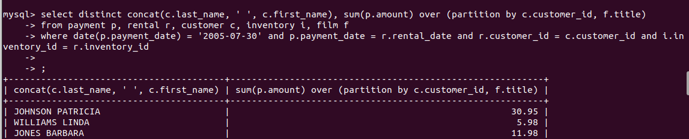
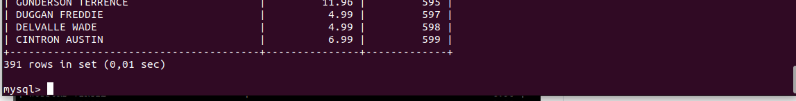

# Домашнее задание к занятию «Индексы»

## Задание 1

Напишите запрос к учебной базе данных, который вернёт процентное отношение общего размера всех индексов к общему размеру всех таблиц.

### Решение

```
select sum(data_length) as SUM_Data_Length, sum(index_length) as SUM_Index_Length, sum(index_length)*100.0/sum(data_length) as Persentage_ratio
from information_schema.tables
where table_schema='sakila' and data_length is not null;
```


## Задание 2

Выполните explain analyze следующего запроса:

```
select distinct concat(c.last_name, ' ', c.first_name), sum(p.amount) over (partition by c.customer_id, f.title)
from payment p, rental r, customer c, inventory i, film f
where date(p.payment_date) = '2005-07-30' and p.payment_date = r.rental_date and r.customer_id = c.customer_id and i.inventory_id = r.inventory_id;
```

*перечислите узкие места;
*оптимизируйте запрос: внесите корректировки по использованию операторов, при необходимости добавьте индексы.

### Решение

Сначала просто выполним запрос


Далее выполним explain analyze.

Длительное время занимает выполнение оконной функции, в которой происходит группировка по столбцам разных таблиц.

Оптимизируем запрос следующим образом:
* удалим из функции столбец f.title и саму таблицу film из запроса
* оконную функцию заменим на group by
* поправим условие where
* добавим join.

Вот что получилось:

```
select distinct concat(c.last_name, ' ', c.first_name), sum(p.amount), c.customer_id
from payment p
join rental r on p.payment_date = r.rental_date 
join customer c on r.customer_id = c.customer_id 
join inventory i on i.inventory_id = r.inventory_id 
where  date(p.payment_date) >= '2005-07-30' and date(p.payment_date) < DATE_ADD('2005-07-30', INTERVAL 1 DAY)
group by c.customer_id;
```





Запрос стал выполняться быстрее.
