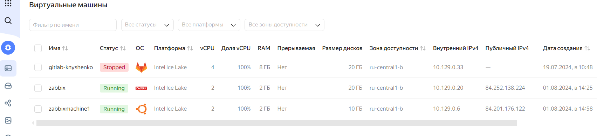
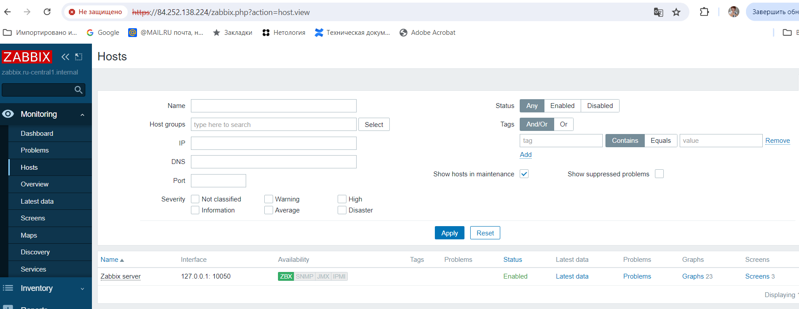
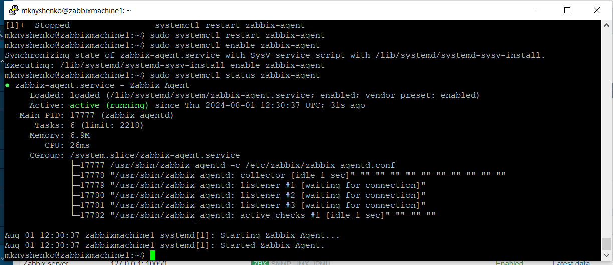
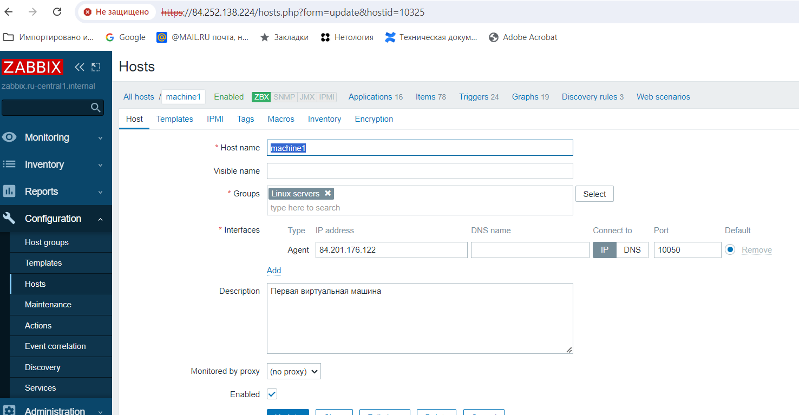
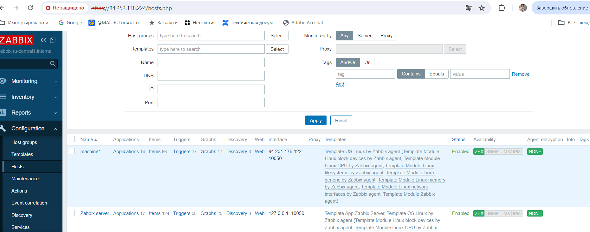
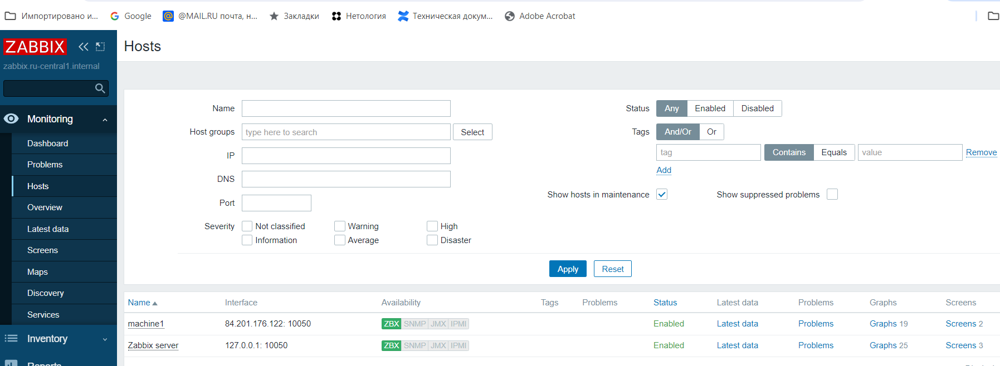
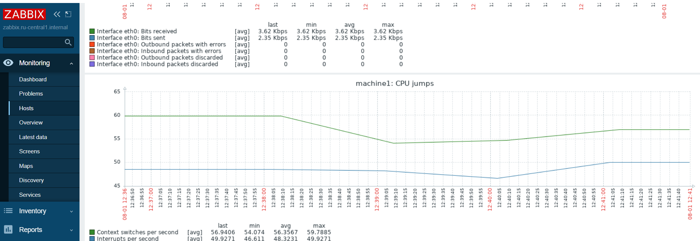

# Домашнее задание к занятию «Система мониторинга Zabbix»
## Задание 1
Создадим в Yandex.Cloud две виртуальные машины: одну будем использовать как Zabbix сервер, на второй установим Zabbix-агент

Заходим в админку Zabbix сервера

Сейчас на мониторинге находится только один хост 127.0.0.1. Это и есть наша виртуальная машина, на которой мы установили Zabbix сервер.

Но в задании машин должно быть две.

## Задание 2

Установим на второй виртуальной машине Zabbix агента.

Агент работает, но этого мало. Нужно поправить файл конфигурации.

Откроем файл /etc/zabbix/zabbix_agentd.conf

В нем укажем:

- IP-адрес, на котором находится сервер Zabbix.
  - Server=84.252.138.224
- Продублируем ip-адрес в параметр, который отвечает за активный режим, когда Zabbix самостоятельно запрашивает необходимые данные
  - ServerActive=84.252.138.224
- Имя хоста
  - Hostname=machine1

Теперь нужно добавить наш новый хост в Zabbix сервер в разделе Configuration - Hosts.

Новый хост добавлен

Перейдем в раздел Мониторинг и посмотрим, что получилось. Мы видим на мониторинге уже два хоста.

Откроем граф для второй виртуальной машины, на которой установлен только агент

Данные собираются.
