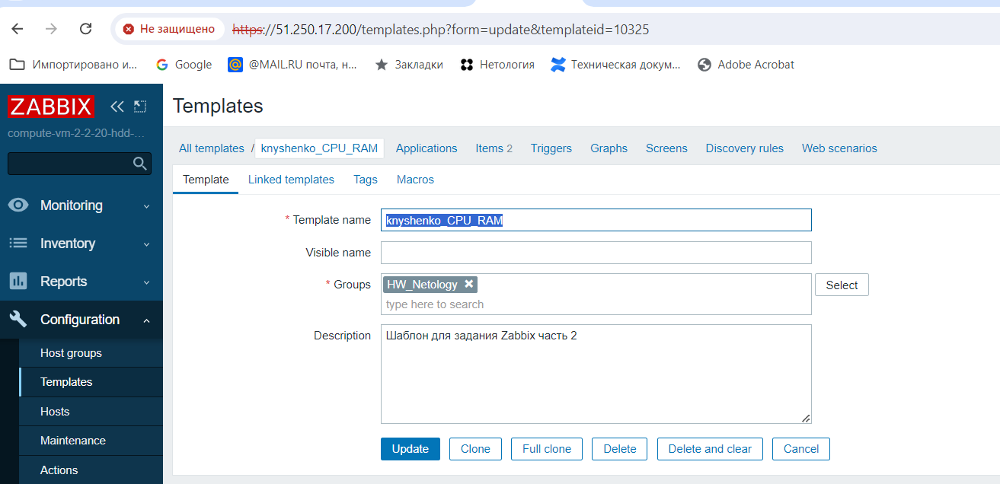
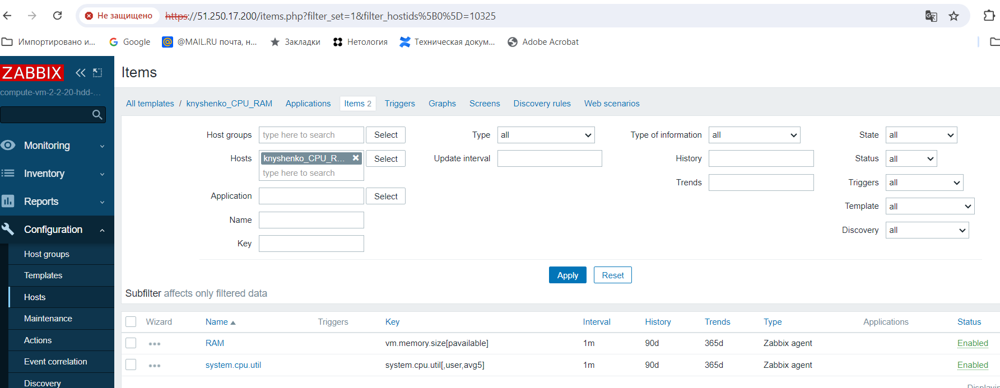
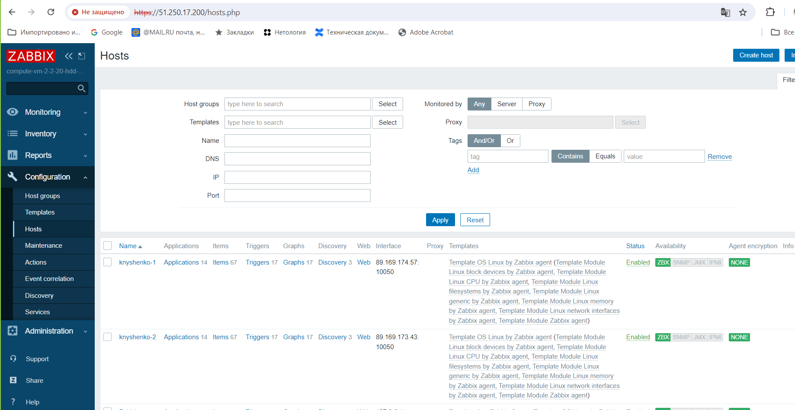
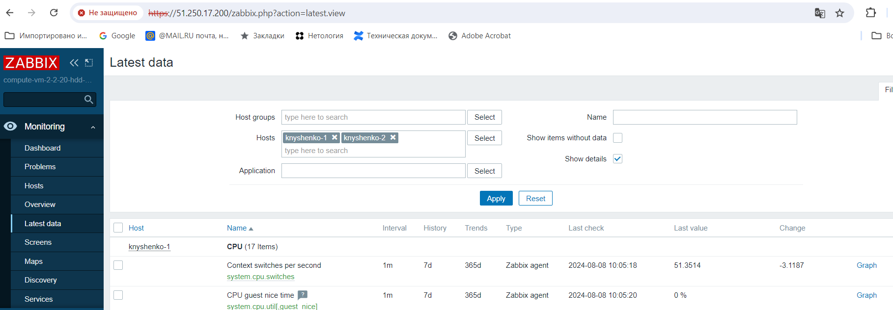
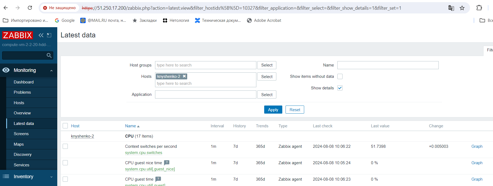
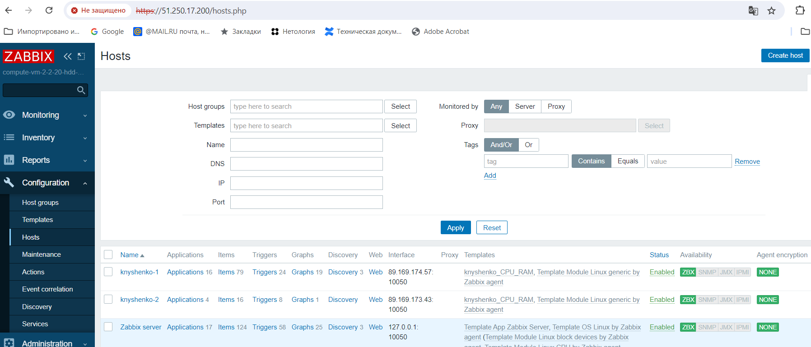

# Домашнее задание к занятию «Система мониторинга Zabbix. Часть 2»
## Задание 1

Сначала создадим новый шаблон

Добавим items

* Создайте Item который будет собирать информацию об загрузке CPU в процентах
** Используем system.cpu.util[<cpu>,<тип>,<режим>]
*** по умолчанию используются все cpu. Так и оставим
*** в типе укажем user
*** выберем avg5, то есть усреднение за 5 минут
* Создайте Item который будет собирать информацию об загрузке RAM в процентах
** Используем vm.memory.size[<режим>]
*** Укажем режим pavailable, то есть "доступно, в процентах"

## Задание 2

Сначала создадим два хоста knyshenko-1 и knyshenko-2

Прикрепим к ним шаблон

Убедимся, что данные собираются

## Задание 3

Прикрепим шаблон, созданный в задании 1.

